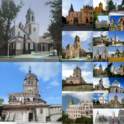

## Styleformer -- Official PyTorch implementation

**Transformer based Generative Adversarial Networks with Style Vector**<br>

<div align="left">
  
  
</div>


## Requirements

* We have done all testing and development using 4 Titan RTX GPUs with 24GB.
* 64-bit Python 3.7 and PyTorch 1.7.1. 
* Python libraries: `pip install click requests tqdm pyspng ninja imageio-ffmpeg==0.4.3`.  We use the Anaconda3 2020.11 distribution which installs most of these by default.


## Generating images

Pre-trained networks are stored as `*.pkl` files that can be referenced using local filenames

```.bash
# Generate images using pretrained_weight 
python generate.py --outdir=out --seeds=100-105 \
    --network=path_to_pkl_file
```

Outputs from the above commands are placed under `out/*.png`, controlled by `--outdir`. Downloaded network pickles are cached under `$HOME/.cache/dnnlib`, which can be overridden by setting the `DNNLIB_CACHE_DIR` environment variable. The default PyTorch extension build directory is `$HOME/.cache/torch_extensions`, which can be overridden by setting `TORCH_EXTENSIONS_DIR`.


## Preparing datasets


**CIFAR-10**: Download the [CIFAR-10 python version](https://www.cs.toronto.edu/~kriz/cifar.html) and convert to ZIP archive:

```.bash
python dataset_tool.py --source=~/downloads/cifar-10-python.tar.gz --dest=~/datasets/cifar10.zip
```

**STL-10**: Download the stl-10 dataset 5k training, 100k unlabeled images from [STL-10 dataset page](https://cs.stanford.edu/~acoates/stl10/) and convert to ZIP archive:

```.bash
python dataset_tool.py --source=~/downloads/cifar-10-python.tar.gz --dest=~/datasets/stl10.zip \
    ---width=48 --height=48
```

**CelebA**: Download the CelebA dataset Aligned&Cropped Images from [CelebA dataset page](http://mmlab.ie.cuhk.edu.hk/projects/CelebA.html) and convert to ZIP archive:

```.bash
python dataset_tool.py --source=~/downloads/cifar-10-python.tar.gz --dest=~/datasets/stl10.zip \
    ---width=64 --height=64
```


**LSUN Church**: Download the desired categories(church) from the [LSUN project page](https://www.yf.io/p/lsun/) and convert to ZIP archive:

```.bash

python dataset_tool.py --source=~/downloads/lsun/raw/church_lmdb --dest=~/datasets/lsunchurch.zip \
    --width=128 --height=128
```


## Training new networks

In its most basic form, training new networks boils down to:

```.bash
python train.py --outdir=~/training-runs --data=~/mydataset.zip --gpus=1 --batch=32 --cfg=cifar --g_dict=256,64,16 \
    --num_layers=1,2,2 --depth=32
```

* `--g_dict=` it means 'Hidden size' in paper, and it must be match with image resolution.
* `--num_layers=` it means 'Layers' in paper, and it must be match with image resolution.
* `--depth=32` it means minimum required depth is 32, described in Section 2 at paper.
* `--linformer=1` apply informer to Styleformer.

Please refer to [`python train.py --help`](./docs/train-help.txt) for the full list. 
To train STL-10 dataset with same setting at paper, please fix the starting resolution 8*8 to 12*12 at training/networks_Generator.py.


## Quality metrics

Quality metrics can be computed after the training:

```.bash
# Pre-trained network pickle: specify dataset explicitly, print result to stdout.
python calc_metrics.py --metrics=fid50k_full --data=~/datasets/lsunchurch.zip \
    --network=path_to_pretrained_lsunchurch_pkl_file
    
python calc_metrics.py --metrics=is50k --data=~/datasets/lsunchurch.zip \
    --network=path_to_pretrained_lsunchurch_pkl_file    
```

## Citation


The code is heavely based on the [stylegan2-ada-pytorch implementation](https://github.com/NVlabs/stylegan2-ada-pytorch)

